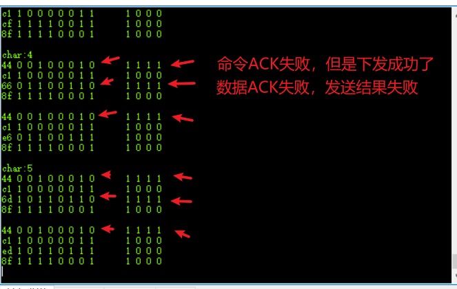

# 目标

显示、修改时间，[时：分，XX：XX]

# 准备

## 硬件

TM1637 驱动、3642BS七段共阳数码管、`stm32f103c8t6`


## 软件

IAR、串口工具

# 规划设想

1.  驱动TM1637，显示时间
2.  两个按键实现修改时间
3.  可能使用HAL库，STM32F108
4.  可能使用Arduino

实施细分：

1.初始化TM1637，配置TM1637

TM1637不需要初始化，但是单片机需要初始化，包括时钟的配置、引脚的配置

硬件知识


```c
char SEGChar[] = {'0' , '1'   , '2'   , '3'   , '4'   , '5'   , '6'   , '7'   , '8'   , '9'   , 'A'   , 'B'   , 'C'   , 'D'   , 'E'   , 'F'   , 'H'   , 'L'   , 'n'   , 'u'   , 'P'   , 'o'   , '-'   , '\0'
}; //只用于第二位7段数码管有小数点显示

uint8_t SEGData[][24] =
{
    /*共阳 不带小数点 */
    {0x40, 0x79, 0x24, 0x30, 0x19, 0x12, 0x02, 0x78, 0x00, 0x10, 0x08, 0x03, 0x46, 0x21, 0x06, 0x0e, 0x09, 0x47, 0x48, 0x41, 0x0c, 0x23, 0x3f, 0x7f},
    /*共阳 带小数点 = 不带小数点 + 0x80，即最高位表示点*/
    {0xC0, 0xF9, 0xA4, 0xB0, 0x99, 0x92, 0x82, 0xF8, 0x80, 0x90, 0x88, 0x83, 0xC6, 0xA1, 0x86, 0x8E, 0x89, 0xC7, 0xC8, 0xC1, 0x8C, 0xA3, 0xBF, 0xFF},
    
    /*共阴 不带小数点*/
    {0x3F, 0x06, 0x5B, 0x4F, 0x66, 0x6D, 0x7D, 0x07, 0x7F, 0x6F, 0x77, 0x7C, 0x39, 0x5E, 0x79, 0x71, 0x76, 0x38, 0x37, 0x3E, 0x73, 0x5C, 0x40, 0x00},
    /*共阴 带小数点 = 不带小数点 + 0x80*/
    {0xbf, 0x86, 0xdb, 0xcf, 0xe6, 0xed, 0xfd, 0x87, 0xff, 0xef, 0xf7, 0xfc, 0xb9, 0xde, 0xf9, 0xf1, 0xf6, 0xb8, 0xb7, 0xbe, 0xf3, 0xdc, 0xc0, 0x80},
};
```

问题1：

TM1637 驱动的是共阳数码管，硬件也确实是共阳数码管，但软件上使用共阴码

问题2：

中间冒号似乎无法熄灭，也就无法闪烁。

发现是所有字节的最高位为0就无法得到ACK，而有的数据字节最高位是表示冒号的状态，所以无法设置冒号。

发送时，数据低位在前，所以发送字节时最后一位是数据高位，然后就等待ACK，试验显示失败。



检查发送字节`TM1637_WriteByte()`代码和`TM1637_WaitAck()`函数代码

问题关键，这里未拉低，后面就直接把DIO设置为上拉输入，也就是在CLK高时DIO由低变高，这属于STOP信号，TM1637接收到停止信号直接断开了。导致TM1637只接收了7位数据，操作结果没有成功。

但是命令似乎成功了。

问题解决：

```c
int TM1637_WriteByte(uint8_t oneByte)
{
    uint8_t i;
    
    printf("%02x ",oneByte);
    for (i = 0; i < 8; i++) {
        /*  在输入数据时，
        当 CLK 是高电平时，DIO 上的信号必须保持不变；
        只有 CLK 上的时钟信号为低电平时，DIO 上的信号才能改变。
        */
        TM1637_clk = 0; /*CLK 上的时钟信号为低电平*/
        
        /*DIO 上的信号才能改变*/
        
        TM1637_dio =  oneByte & 0x01;
        printf("%d ", TM1637_dio);
        delay_us(3);
        TM1637_clk = 1; /*当 CLK 是高电平时，DIO 上的信号必须保持不变；*/
        delay_us(5);
        oneByte = oneByte >> 1;
    }
    TM1637_clk = 0; /*问题关键，这里未拉低，后面就把DIO设置为上拉输入，就是在CLK高时DIO由低变高，属于STOP信号，TM1637接收到信号直接断开了*/

        
    return TM1637_WaitAck();
}
```


结论经验：发送结束状态必须使CLK=0；这样DIO的状态不会影响到下一步操作。


[参考](https://www.ccarea.cn/archives/264)


[参考](https://blog.csdn.net/qq_20222919/article/details/111571937)

时钟显示模块  [参考](https://blog.csdn.net/q1241580040/article/details/45815245)


2021.5.25实现规划设想1
